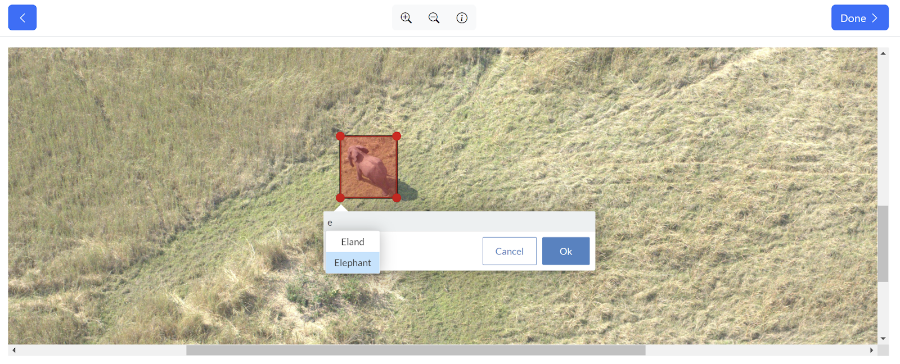

# Scout

Scout is a software application designed to support annotators and lab leads processing imagery for the Kavango–Zambezi Transfrontier Conservation Area (KAZA TFCA) aerial survey of animals.

With Scout, you can:

* Ingest high volumes of .ARW and .JPG images collected from survey cameras
* Group images as “Tasks” that can be assigned to other users (e.g., image annotators) or machine learning (ML) models for bounding box creation and species labeling
* Review and ground truth annotated images for accuracy
* Draw division lines for overlapping image sequences with annotations
* Export CSV data files for statistical analysis

## System Requirements

**NOTE**: This software is designed to run on an air-gapped private network only. (Significant security modifications are needed before this platform is suitable for installation on a public network or cloud).

* A fast and stable internet connection.
* An 8GB-minimum thumbdrive.
* A dedicated, powerful laptop with a graphics processing unit (GPU) to run solely as the Scout server: see [Scout Server Laptop](https://docs.wildme.org/product-docs/en/scout/system-administrators/system-requirements/#scout-server-laptop) documentation. **NOTE**: Installation will remove all data and Windows from the Scout Server laptop, and install Ubuntu Linux as the operating system.
* Laptops with the Chrome web browser to connect to the Scout server for lab leads and annotators.

## Installation

For installation and first-time configuration steps, follow our [System Installation](https://docs.wildme.org/product-docs/en/scout/system-administrators/system-installation/#system-installation) documentation guide. 

## Important Links & Docs

Use our [Help Documentation](https://docs.wildme.org/product-docs/en/scout/) to learn how to use Scout.

Visit [Wild Me Professional Services](https://www.wildme.org/services) to view the range of services we can offer. 

## Support

For technical support from the Wild Me team, please visit our [Community page](https://community.wildme.org).

For direct help, email the Wild Me engineering staff at support@wildme.org.

## Usage

Scout supports three user roles:

* System Administrators install and run Scout.
* Lab leads create and manage user accounts, upload images, coordinate tasks, review and ground truth annotations, draw division lines, and export data.
* Annotators draw and label bounding boxes representing animals on images.  

Lab leads view, filter, manage, and export Tasks using the Task table:

[]

Annotators and ML models use bounding boxes, species labels, and annotation labels to indicate animals in images:

[]

## Techstack and Features

Scout uses Javascript and integrated machine learning. 

## License

Scout is licensed under the [MIT open source license](https://opensource.org/license/mit/).

